# Figure 1: The experimental arc

This diagram shows the scientific timeline of the paper as it actually
unfolded: pre-register predictions, train models after lockdown, falsify,
revise the framework, re-test on a new pre-registered domain, falsify again
on the null direction, run post-hoc controls. Every commit hash and gap
number is the actual value reported in the paper.

```mermaid
flowchart TD
    classDef preregStyle fill:#e1f0ff,stroke:#3a7bd5,stroke-width:2px,color:#1a3a6e
    classDef confirmStyle fill:#d4f4dd,stroke:#1a8a3a,stroke-width:2px,color:#0d4a1f
    classDef falsifyStyle fill:#ffd9d9,stroke:#c92a2a,stroke-width:2px,color:#6e1a1a
    classDef reviseStyle fill:#fff3bf,stroke:#e08e0b,stroke-width:2px,color:#5c3a08
    classDef verdictStyle fill:#f3d9fa,stroke:#9c36b5,stroke-width:2px,color:#3d1a4e

    S1["<b>Step 1: Lock maze predictions</b><br/>commit aa025b1 (2026-05-27)<br/>P4: starting cell predicted NULL<br/>falsification threshold gap > 0.10"]
    S2["<b>Step 2: Train maze model</b><br/>(after lockdown)"]
    P4{"<b>P4 verdict</b><br/>observed gap +0.152<br/>(threshold +0.10)"}
    S3["<b>Step 3: Framework revision</b><br/>Strict N-criterion fails<br/>Propose architectural carry-through<br/>Adopt graded form"]
    S4["<b>Step 4: Lock HTTP predictions</b><br/>commit 3b25ed3 (2026-05-31)<br/>Feature A: carry-through encoded<br/>Feature B: computed null"]
    S5["<b>Step 5: Train HTTP model</b><br/>(after lockdown)"]
    A1{"<b>Feature A verdict</b><br/>observed gap +0.168<br/>(threshold +0.10)"}
    B1{"<b>Feature B verdict</b><br/>observed gap +0.291<br/>(threshold +0.10)"}
    A_OK["<b>Feature A CONFIRMED</b><br/>carry-through 2-for-2"]
    B_AMB["<b>Feature B apparently falsified</b><br/>position-confound suspected"]
    S6["<b>Step 6: Position-control follow-up</b><br/>position-control probe: gap +0.43<br/>Design A (fixed k=5): gap +0.22<br/>Design B3 (residual): R^2 gap +0.47"]
    B2{"<b>Feature B at fixed position</b><br/>observed gap +0.220<br/>(threshold +0.10)"}
    B_FALS["<b>Feature B FALSIFIED</b><br/>even after position control"]
    S7["<b>Step 7: Final verdict</b><br/>Carry-through: 2-for-2 confirmed<br/>Broader N-criterion: 0-for-3 on risky predictions<br/>Position-correlation: methodological caveat"]

    S1 --> S2
    S2 --> P4
    P4 -->|encoded above threshold| S3
    S3 --> S4
    S4 --> S5
    S5 --> A1
    S5 --> B1
    A1 -->|encoded above threshold| A_OK
    B1 -->|encoded above threshold| B_AMB
    B_AMB --> S6
    S6 --> B2
    B2 -->|still above threshold| B_FALS
    A_OK --> S7
    B_FALS --> S7

    class S1,S4 preregStyle
    class A_OK confirmStyle
    class B_FALS,B_AMB falsifyStyle
    class S3,S6 reviseStyle
    class S7 verdictStyle
```



## How to read this diagram

- **Blue boxes**: pre-registration milestones. The predictions file was
  committed to git at the named hash before any model in that step was
  trained.
- **Green boxes**: confirmed predictions (observed gap exceeds the
  pre-registered threshold).
- **Red boxes**: falsified predictions.
- **Yellow boxes**: framework revision and post-hoc methodology controls.
- **Purple box**: the final verdict integrating all evidence.

## Audit trail

Every commit hash on the diagram is verifiable from the project repository:

```bash
git log --diff-filter=A predictions/predictions_maze_navigation.md
git log --diff-filter=A predictions/predictions_http_log_sequences.md
```

Both commands return the commit hash predating any model training, data
preparation, or probe run for the corresponding domain.
